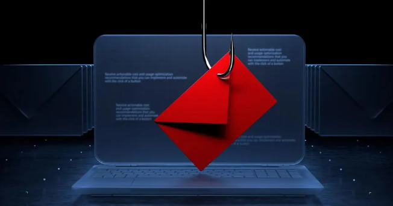
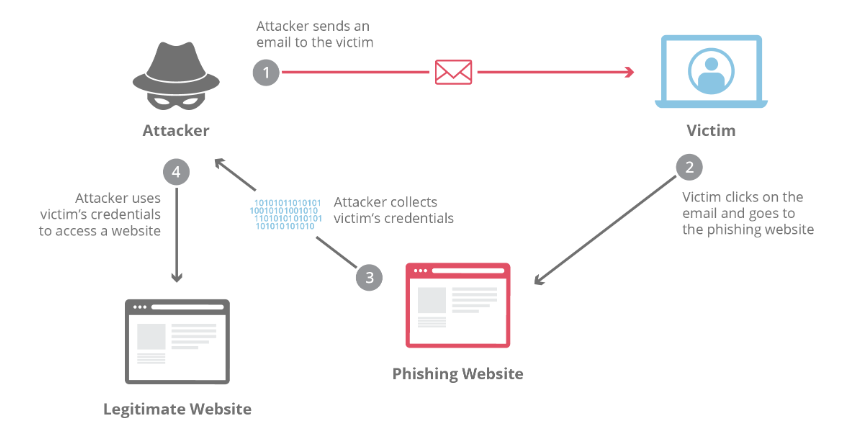

# Phishing-Email-Analysis

### Phishing is a type of cyberattack that uses fraudulent emails, text messages, phone calls, or websites to trick people into sharing sensitive data, downloading malware, or otherwise exposing themselves to cybercrime. 

  

   
  

## Useful Tool
[MX Lookup](https://mxtoolbox.com/ "MX Lookup")

## Online URL/Attachment Analysis Tools
[AnyRun](https://app.any.run/ "AnyRun")\
[Hybrid Analysis](https://www.hybrid-analysis.com/ "Hybrid Analysis")\
[urlscan](https://urlscan.io/ "urlscan")

## Reputation Check
[Virustotal](https://www.virustotal.com/gui/ "Virustotal")

## Overview

  

   
  

## Email Header
It is a section of email that contains information like sender, recipient, date, and subject.

#### Example:
""" MIME-Version: 1.0
Received: by 10.220.191.194 with HTTP; Wed, 11 May 2011 12:27:12 -0700 (PDT)
Date: Wed, 11 May 2011 13:27:12 -0600
Delivered-To: jncjkq@gmail.com
Message-ID: <BANLkTi=JCQO1h3ET-pT_PLEHejhSSYxTZw@mail.jncjkq.com>
Subject: Test
From: Bill Jncjkq <jncjkq@gmail.com>
To: bookmarks@jncjkq.net """

